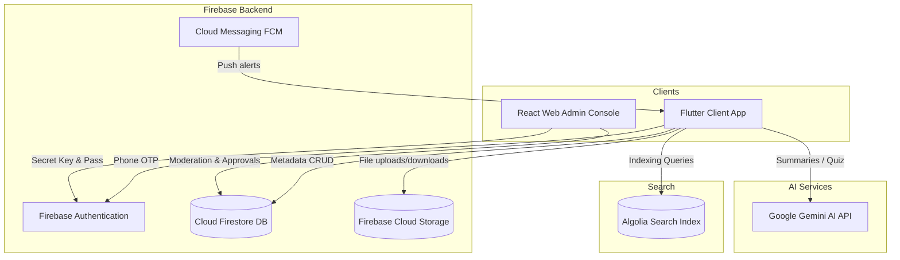

# UG eLibrary

Link: ug-elibrary.in
      ug-elibrary.wep.app

UG eLibrary is a production-ready, full-stack educational library ecosystem designed for colleges. It provides students, teachers, and administrators with a centralized digital space to organize, search, study, and moderate syllabus documents and UPSC preparations.

---

## Workspace Layout

The repository is structured into isolated, cohesive packages:

```
d:/UG eLibrary/
├── mobile_app/                 # Flutter Mobile Client (Android & iOS)
├── admin_panel/                # React.js Web Admin Console (MUI, Vite)
├── firebase/                   # Firebase Firestore Rules & Storage Configs
├── .env.example                # Config template file
├── README.md                   # System Architecture (This File)
├── API_DOCUMENTATION.md        # Firestore Schema & API Specifications
├── INSTALLATION_GUIDE.md       # Dev Environment Setup Instructions
└── DEPLOYMENT_GUIDE.md         # Production Compilation & Deployment Guide
```

---

## Technical Stack & Packages

### 1. Flutter Mobile App (lib/)
* **Architecture**: MVVM (Model-View-ViewModel) with structured data folders.
* **State Management**: [Riverpod](https://pub.dev/packages/flutter_riverpod) for high-performance dependency injection.
* **Database & Caching**: [Hive](https://pub.dev/packages/hive_flutter) for offline settings and local files metadata registry.
* **PDF Engine**: [Syncfusion PDF Viewer](https://pub.dev/packages/syncfusion_flutter_pdfviewer).
* **AI Engine**: [Google Gemini AI API](https://pub.dev/packages/google_generative_ai) for document summaries and MCQs quiz generation.
* **Search Engine**: [Algolia Search SDK](https://pub.dev/packages/algolia).

### 2. React Admin Panel
* **Frontend Library**: React 18 with [Vite](https://vitejs.dev/) bundler.
* **Design System**: Material UI (MUI) components library.
* **Backend Bridge**: Firebase JS SDK (Authentication & DB).

### 3. Firebase Backend
* **Auth**: OTP SMS Verification & Firebase sessions.
* **DB**: Cloud Firestore.
* **Storage**: Firebase Cloud Storage bucket.
* **Push Notifications**: Firebase Cloud Messaging (FCM).

---

## System Architecture



---

## Key Modules & Flows

1. **Teacher Registration flow**: Teachers request account access. Upload capabilities remain locked until verified by an Administrator in the React Admin Console.
2. **Infinite nested folders**: Approved teachers can organize study folders to arbitrary depths within subjects: `College -> Branch -> Year -> Subject -> Unit -> nested subfolders`.
3. **Resumeable download manager**: Custom HTTP chunk downloader with pause/resume support using local temp byte buffers.
4. **Instant lookup**: Global text querying optimized with client-side indexing.
5. **AI Helper**: Automated note reading giving high-fidelity summaries and interactive quiz question sheets.
